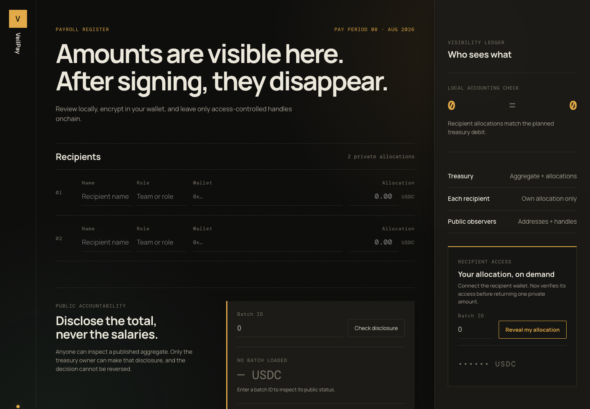

# Private payroll, public settlement

VeilPay is an open-source confidential payroll layer built for the iExec Nox Protocol. A treasury operator submits two encrypted allocations; each recipient receives access only to their own allocation, while the treasury retains access to the encrypted batch total. The owner can later make only that aggregate publicly decryptable.

**Live application:** https://yonkoo11.github.io/veilpay/

**Demo video:** [76-second product demo](video/out/veilpay-demo.mp4)



## Privacy model

Public onchain data:

- recipient addresses;
- batch identifier and timing;
- encrypted handles;
- aggregate disclosure status.

Confidential data:

- individual payroll amounts;
- batch total before deliberate publication.

Trust assumptions:

- Nox gateway, KMS, runner and TEE-backed execution remain available and behave as documented;
- recipient addresses and transaction timing can still reveal relationships;
- VeilPay V1 proves confidential accounting and ACL behavior, not token custody or employment-law compliance.

## Architecture

- `contracts/VeilPayroll.sol`: encrypted allocations, encrypted total, recipient/treasury ACLs and aggregate disclosure.
- `test/integration/payroll.test.ts`: Docker-backed Nox encryption, resolution, decryption and permission checks.
- `src/lib/payroll.ts`: browser wallet connection, official `@iexec-nox/handle` encryption, Sepolia submission, recipient-authorized decryption and aggregate publication.
- `src/App.svelte`: operator payroll ledger, visibility proof, recipient allocation reveal and deliberate public-accountability console.
- `e2e/payroll.spec.ts`: desktop/mobile browser checks, including a live read-only call to the deployed Sepolia contract.

## Install and run

Requirements: Node.js 22+, Docker/OrbStack, and an Ethereum browser wallet.

```bash
npm install
npm run dev
```

Open `http://127.0.0.1:4173`.

## Verify locally

```bash
npm run typecheck
npm run test:unit
npm run build
npm run contract:compile
npm test
npm run test:ui
npm run verify:sepolia
```

`npm test` starts the official Nox off-chain stack with Docker. Its first run downloads the Nox images. The stable plugin assigns the local handle gateway a free host port automatically, so it can coexist with frontend dev servers using port `3000`. `npm run test:ui` checks both desktop and mobile and makes one read-only call to the deployed Sepolia contract; it never submits a transaction.

## Ethereum Sepolia deployment

VeilPayroll is deployed and read-only verified on Ethereum Sepolia:

- Contract: [`0x1F82E5aB72B6Ec93e852533Ed9D021CbF51969AC`](https://sepolia.etherscan.io/address/0x1F82E5aB72B6Ec93e852533Ed9D021CbF51969AC)
- Deployment transaction: [`0x1e2186…96ada`](https://sepolia.etherscan.io/tx/0x1e21868422980a12d191f91181331669786cd66e47c7152c2ca438c477b96ada)
- Block: `11397924`
- Owner: `0xf9946775891a24462cD4ec885d0D4E2675C84355`
- NoxCompute: `0x24Ef36Ec5b626D7DCD09a98F3083c2758F0F77bF`
- Nox gateway: `https://gateway-testnets.noxprotocol.dev`
- Ethereum Sepolia subgraph: `https://thegraph.ethereum-sepolia-testnet.noxprotocol.io/api/subgraphs/id/9CsccKwvgYFo72zZeU4k4wj2NEBLdWhVE3EUandgmzgo`

Verified confidential demonstration, batch `0`:

- Batch creation: [`0x34a19e…6ec08`](https://sepolia.etherscan.io/tx/0x34a19e2d6187f733d04c6e0ade7db9c9cae2f88699ca28fe1395def8eac6ec08)
- Aggregate publication: [`0x4b88c9…8c045`](https://sepolia.etherscan.io/tx/0x4b88c9900c7274dc77063a8077d85ed784bb161b39072f6ca56e14e5fcf8c045)
- Private allocations verified through the authorized owner: `1` and `2` test units.
- Publicly decrypted aggregate: `3` test units.

The public application configuration is versioned in `src/lib/network.ts`; no browser secret or private key is required. Verify the receipt, owner, VeilPayroll bytecode and NoxCompute bytecode at any time:

```bash
npm run verify:sepolia
```

Browser wallets sign user transactions. The payroll submit action rejects any account other than the deployed treasury owner before encrypting values.

## Prepare a Sepolia deployment

Hardhat reads deployment values from process environment variables outside this repository:

```bash
export DEPLOYER_PRIVATE_KEY=…
# Optional: override the public Sepolia RPC configured in hardhat.config.ts
export SEPOLIA_RPC_URL=…
```

The deployment command verifies chain ID `11155111`, deployer funding and official NoxCompute bytecode before deploying. It is guarded against accidental replacement deployments:

```bash
ALLOW_SEPOLIA_REDEPLOY=1 npm run deploy:sepolia
```

This command performs an on-chain write and must only be run with explicit approval. The existing deployment should be used unless a replacement has been intentionally approved.

## Contract flow

1. The browser encrypts both `uint256` allocations for the VeilPayroll contract.
2. `createBatch` converts the external handles with `Nox.fromExternal`.
3. `Nox.add` computes the encrypted total.
4. The contract grants each recipient access only to their allocation and grants the treasury access to both allocations and the total.
5. `publishTotal` irreversibly enables public decryption of only the aggregate.
6. A recipient can enter a batch ID, connect the matching wallet and authorize Nox to decrypt only that wallet's allocation. The plaintext exists only in page memory and is not persisted.
7. Anyone can inspect whether an aggregate is public. The owner-only publication action is isolated behind an irreversible-action confirmation, after which only the total is publicly decrypted.

## Current status

- Frontend type checks, 12 unit tests and production build pass.
- Solidity contract compiles with Solidity 0.8.35.
- The Hardhat suite passes locally: 15/15 tests (12 unit and 3 Docker-backed Nox end-to-end tests) across draft validation, safe error copy, recipient and treasury boundaries, encrypted input, confidential addition, per-recipient ACLs, aggregate publication and invalid-access paths.
- Browser smoke suite passes 6/6 across desktop and mobile, including responsive overflow checks and a live Sepolia contract read.
- VeilPayroll is deployed on Ethereum Sepolia, and a read-only verifier confirms its successful receipt, bytecode, owner, batch state and NoxCompute dependency.
- Public Nox and contract coordinates are configured in the frontend.
- Batch `0` proves the live confidential path: authorized private decryption returned allocations `1` and `2`, while public decryption returns only their published aggregate, `3`.

## License

MIT. See [LICENSE](LICENSE).
